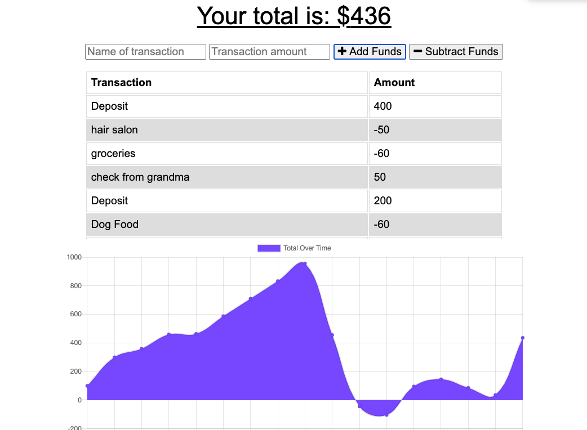

# Budget Tracker

## Table of Contents
* [Description](#description)
* [Usage](#usage)
* [Links](#links)
* [Screenshots](#screenshots)
* [Questions](#questions)

## Description
An application that helps track the users budget online or offline. The application tracks the users money by having inputs for the description of the transation, inputing the amount, and either adding the amount or subtracting the amount. The transaction entered are tracked with a total at the top of the page and a chart to see how the user has been spending their money. This is a great way for users to keep track of everyday transations to stay within their budget. The application functions offline as well, allowing the user to input transactions from anywhere needed.

## Usage
This application can be used to track everyday money transactions for users to monitor their spending. 

## Links
Github Repo: https://github.com/nataliegarcia-8/budget-tracker

Deployed Site: https://agile-garden-62025.herokuapp.com/

## Screenshots
Budget Tracker Website:

## Questions 
### If you have any questions please contact me at:
Email: gnatalie.booking@gmail.com

Github: https://github.com/natalie-garcia-8